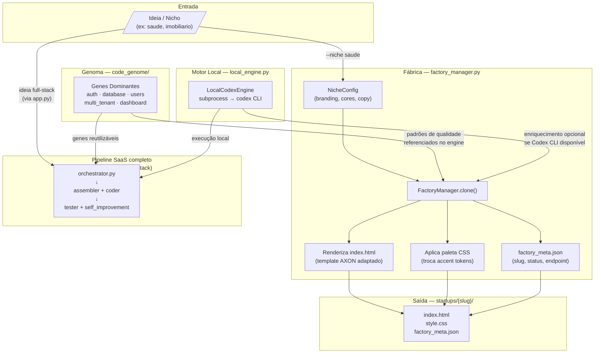

# SYSTEM_MAP — Nexora Agente
> Documento vivo. Atualizar a cada mudança de fluxo, infraestrutura ou produto.
> Última revisão: 2026-03-10

---

## 1. Árvore de Diretórios

```
D:\Nexora_Agente\
│
├── app.py                        # Dashboard Streamlit (entrada principal)
├── local_deploy.py               # Deploy dos startups para _publish/
├── test_local_engine.py          # Teste de integração do motor local
│
├── core/                         # ── NÚCLEO DO AGENTE ──────────────────────
│   ├── factory_manager.py        # [NOVO] Fábrica de Landing Pages por nicho
│   ├── local_engine.py           # [NOVO] Motor subprocess → Codex CLI local
│   ├── orchestrator.py           # Orquestrador principal do pipeline SaaS
│   ├── llm_client.py             # Cliente OpenRouter (LLM externo)
│   ├── assembler.py              # Montagem física do projeto no workspace
│   ├── coder.py                  # Geração de lógica de negócio
│   ├── genome_factory.py         # Promoção de projetos a genes
│   ├── genome_search.py          # Busca semântica no índice de genes
│   ├── genome_rag.py             # RAG sobre o code_genome
│   ├── self_improvement.py       # Loop de auto-melhoria do agente
│   ├── shadow_tester.py          # Testes de segurança / fuzzing
│   ├── advice_engine.py          # Motor de alertas CRITICAL/SECURITY
│   ├── cleaner.py                # Sanitização do workspace
│   ├── prompt_optimizer.py       # Otimização de prompts por papel
│   ├── project_analyzer.py       # Análise de saúde de projetos
│   ├── sandbox.py                # Execução isolada de código
│   ├── tester.py / tester_agent.py / test_runner.py
│   ├── docs_agent.py             # Geração de README técnico
│   ├── file_manager.py           # CRUD de arquivos no workspace
│   └── executor_schema.py        # Schema de resposta do executor
│
├── code_genome/core/             # ── GENES DOMINANTES ──────────────────────
│   ├── auth/                     # JWT login/registro — economia 45k tokens
│   ├── database/                 # SQLAlchemy + migrations — 28k tokens
│   ├── users/                    # CRUD de usuários Pydantic — 30k tokens
│   ├── multi_tenant/             # Isolamento tenant_id — 40k tokens
│   └── dashboard/                # Layout Streamlit base — 35k tokens
│
├── startups/                     # ── PRODUTOS GERADOS ──────────────────────
│   │
│   ├── axon/                     # [CONGELADO] Produto em produção
│   │   ├── index.html            # Landing Page Dark/Glassmorphism
│   │   ├── style.css             # Design System iOS/Apple
│   │   ├── axon_engine.py        # Motor de auditoria de código (AST+regex)
│   │   ├── audit_report.html     # Template de relatório interativo
│   │   ├── api_bridge.py         # API Flask → porta 5005
│   │   └── requirements.txt      # flask>=3.0, gunicorn>=21.2
│   │
│   ├── saude/                    # [AGUARDANDO ATIVAÇÃO] MEDIX — Gestão Clínica
│   │   ├── index.html            # LP verde #30d158
│   │   ├── style.css
│   │   └── factory_meta.json
│   │
│   ├── imobiliario/              # [AGUARDANDO ATIVAÇÃO] PROPIX — CRM Imobiliário
│   │   ├── index.html            # LP laranja #ff9f0a
│   │   ├── style.css
│   │   └── factory_meta.json
│   │
│   ├── financas/                 # [RASCUNHO] FINIX — Controle Financeiro PME
│   │   ├── index.html            # LP roxa #bf5af2
│   │   ├── style.css
│   │   └── factory_meta.json
│   │
│   ├── educacao/                 # [RASCUNHO] EDUNIX — Plataforma EAD
│   │   ├── index.html            # LP amarela #ffd60a
│   │   ├── style.css
│   │   └── factory_meta.json
│   │
│   └── vantage/                  # [LEGADO] Origem do AXON — não remover
│
├── docs/deploy_configs/          # ── CONFIGS DE INFRAESTRUTURA ─────────────
│   ├── axon.conf                 # Nginx virtual host (axon.nexora360.cloud)
│   └── axon.service              # Systemd unit (Gunicorn porta 5005)
│
├── dist_vps/axon/                # ── ARTEFATO DE DEPLOY ────────────────────
│   ├── *.html / *.css / *.py     # Cópia limpa dos arquivos publicáveis
│   └── axon_vps.zip              # ZIP pronto para SCP → VPS
│
├── config/
│   └── model_stack.json          # Papéis dos modelos (planner/executor/etc.)
│
├── memory/sqlite/                # Banco local SQLite
│   └── nexora_memory.db          # genome_index · decisions · prompt_cache
│
├── workspace/                    # Projetos SaaS gerados pelo pipeline
└── scripts/                      # init_db, update_genome, utilitários
```

---

## 2. Fluxo de Dados — Nexora como Fábrica de Sites



### Como a Fábrica usa o Codex Local

| Etapa | Módulo | Ação |
|---|---|---|
| 1 | `factory_manager.py` | Carrega `NicheConfig` (branding + copy pré-definido) |
| 2 | `FactoryManager.clone()` | Renderiza HTML/CSS com substituição de tokens |
| 3 | `local_engine.py` | Se `codex` CLI presente: enriquece copy via subprocess |
| 4 | `genome_search.py` | Consulta genes para garantir padrões de Clean Code |
| 5 | `startups/{slug}/` | Entrega `index.html` + `style.css` prontos para deploy |

> O Codex Local é **opcional e não-bloqueante**: se o CLI não estiver no PATH,
> a fábrica entrega a LP completa via template + tokens. Zero dependência externa.

---

## 3. Infraestrutura Externa — VPS

> **Regra:** Nunca alterar esta infraestrutura sem atualizar este mapa.
> **IP da VPS:** `72.61.135.206` (Ubuntu 24.04 LTS)

### Serviços AXON em produção

| Serviço | Endereço público | Porta interna | Processo | Status |
|---|---|---|---|---|
| AXON Landing Page + API | `https://axon.nexora360.cloud` | `5005` | `gunicorn` (axon.service) | **LIVE** |
| Nginx reverse proxy | `:80` → `:443` | — | `nginx/1.24.0` | **LIVE** |
| SSL/TLS | Let's Encrypt | — | certbot (auto-renew) | válido até 2026-06-08 |

### Outros serviços na mesma VPS (não tocar)

| Domínio / Serviço | Porta | Observação |
|---|---|---|
| `oficina.nexora360.cloud` | 3000–3003 (docker) | Projetos existentes |
| `api.nexora360.cloud` | — | API plataforma |
| n8n | 5678 | Automações |
| uvicorn (interno) | 3005 | Serviço Python legado |

### Mapa de portas ocupadas na VPS

```
:22    SSH
:80    Nginx (entrada HTTP → redirect)
:443   Nginx (HTTPS — todos os domínios)
:3000  Docker proxy
:3001  Docker proxy
:3002  Docker proxy
:3003  Docker proxy
:3005  uvicorn (interno)
:5005  Gunicorn AXON  ← nossa porta
:5678  n8n
```

### Arquivos na VPS (AXON)

```
/var/www/axon/
├── index.html
├── style.css
├── axon_engine.py
├── audit_report.html
├── api_bridge.py
├── requirements.txt
└── venv/

/etc/nginx/sites-enabled/axon       → /etc/nginx/sites-available/axon
/etc/systemd/system/axon.service
/etc/letsencrypt/live/axon.nexora360.cloud/
```

### Comandos de manutenção (referência rápida)

```bash
# Status
ssh root@72.61.135.206 "systemctl status axon"

# Logs em tempo real
ssh root@72.61.135.206 "journalctl -u axon -f"

# Reiniciar após atualização
ssh root@72.61.135.206 "systemctl restart axon"

# Health check
curl -s https://axon.nexora360.cloud/api/health
```

---

## 4. Checkpoints de Próximos Produtos

### Sprint Factory — Nichos em fila

| # | Produto | Marca | Nicho | Status | Próximo passo |
|---|---|---|---|---|---|
| 1 | AXON | `axon.nexora360.cloud` | Auditoria de Código IA | **LIVE em produção** | Monitorar métricas |
| 2 | MEDIX | `medix.nexora360.cloud` | Gestão de Clínica | **Aguardando Ativação** | Deploy na VPS (porta 5006) |
| 3 | PROPIX | `propix.nexora360.cloud` | CRM Imobiliário | **Aguardando Ativação** | Deploy na VPS (porta 5007) |
| 4 | FINIX | `finix.nexora360.cloud` | Controle Financeiro PME | Rascunho | Validar copy com cliente |
| 5 | EDUNIX | `edunix.nexora360.cloud` | Plataforma EAD | Rascunho | Validar copy com cliente |
| 6 | AUDITX | `auditor.nexora360.cloud` | Auditoria de Código IA | **Aguardando Ativação** | Motor de auditoria + deploy VPS (porta 5008) |

### Para ativar MEDIX ou PROPIX

```bash
# 1. Gerar (já feito — LP está em startups/saude/ e startups/imobiliario/)
python core/factory_manager.py --niche saude

# 2. Empacotar para VPS
# (adaptar local_deploy.py com SOURCE_DIR = startups/saude, PORT = 5006)

# 3. Na VPS: mesma estrutura do AXON, porta 5006 ou 5007
# axon.service → medix.service (porta 5006)
# axon.conf    → medix.conf (server_name medix.nexora360.cloud)
```

---

## 5. Variáveis de Ambiente (.env)

| Variável | Obrigatória | Descrição |
|---|---|---|
| `WORKSPACE_ROOT` | Sim | Raiz dos projetos gerados |
| `GENOME_ROOT` | Sim | Raiz dos genes (`code_genome/`) |
| `MEMORY_ROOT` | Sim | Raiz da memória local (`memory/`) |
| `JWT_SECRET_KEY` | Sim | Segredo JWT — sem fallback fraco |
| `AUTH_DEMO_PASSWORD` | Sim | Senha de emissão de token |
| `OPENROUTER_API_KEY` | Opcional | LLM externo via OpenRouter |
| `JWT_EXPIRE_MINUTES` | Opcional | Default `60` |
| `AXON_PORT` | Opcional | Porta da API Bridge (default `5005`) |

---

## 6. Banco Local (SQLite)

`memory/sqlite/nexora_memory.db`

| Tabela | Conteúdo |
|---|---|
| `genome_index` | Índice dos genes disponíveis |
| `decisions` (FTS5) | Histórico textual de decisões do agente |
| `prompt_cache` | Cache de prompts e respostas LLM |

---

## 7. Regras de Segurança e Robustez

- Paths absolutos removidos dos módulos centrais — uso de env + fallback local
- Falha de LLM ou JSON inválido → `status: error` (sem falso sucesso)
- Backend gerado sem `AUTH_DEMO_PASSWORD` → resposta `503`
- Backend gerado sem `JWT_SECRET_KEY` → erro explícito na geração/validação
- `shadow_tester.py` bloqueia promoção de gene se score < 90 no Shadow Test
- `advice_engine.py` dispara `hard_stop` em alertas CRITICAL/SECURITY
- **Cleaner só executa após entrega confirmada** via `_safe_cleanup()`:
  - `OUTPUT_DIR` definido **e** cópia verificada no filesystem (`os.path.isdir(dest)`)
  - **ou** `PRESERVE_WORKSPACE=true` no `.env`
  - **ou** gene promovido com sucesso pelo `GenomeFactory`
  - Se nenhuma condição → status `blocked`, workspace preservado automaticamente
- **VPS:** nunca expor porta 5005 diretamente — sempre via Nginx com TLS

---

## 8. Status de Validação

```
python -m compileall -q .     → OK
python -m pytest -q           → 11 testes passando
factory_manager.py --all      → 5 nichos gerados (saude, imobiliario, financas, educacao, auditor)
axon health check             → {"status":"ok","engine_ready":true}
```
